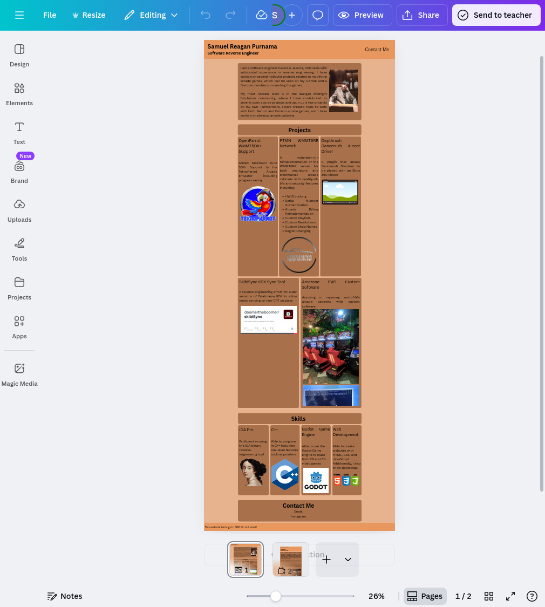
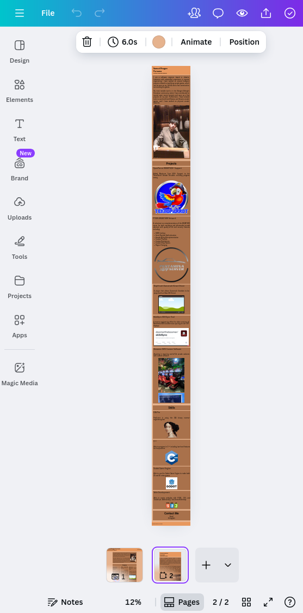
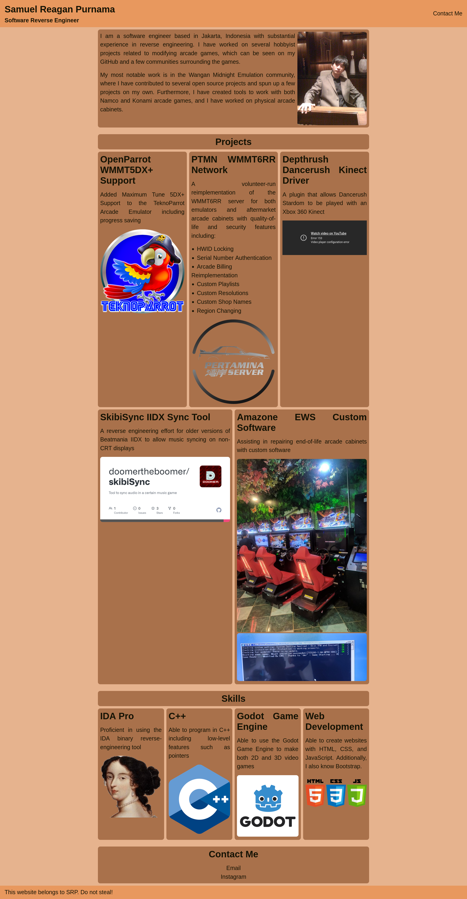
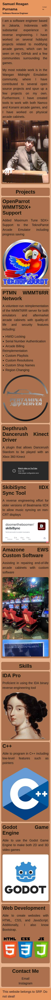

# 🌐 Personal Portfolio Website

## 📖 Project Overview

This is a single-page responsive portfolio website created as part of a lab assignment. The website showcases personal information, projects, skills, and contact details. It is built using **HTML**, and **CSS**.

- URL Link to website portfolio: [Click Here](https://dmr-uni-projects-assignments.github.io/Lab-Assignment-Responsive-Portfolio-Web/)
- URL Link to website design in Canva: [Click Here](https://www.canva.com/design/DAG3VKq43k4/TsvDUFKER6AFEHWp2UH5jg/edit?utm_content=DAG3VKq43k4&utm_campaign=designshare&utm_medium=link2&utm_source=sharebutton)

## 🎯 Purpose

The goal of this project is to:

- Practice responsive web design techniques
- Learn how to structure and style a webpage
- Showcase personal or sample projects in a professional format that anyone can access from any device

## 👥 Target Audience

This portfolio is designed for:

- [✅] Potential employers or recruiters

## 🧱 Technologies Used

- HTML5
- CSS3 (Flexbox, Box Models, Media Queries)

## 📐 Layout & Sections

The website includes the following sections:

- **Header** – Name and tagline
- **About Me** – Short bio and photo
- **Projects** – List of projects with descriptions and links
- **Skills** – Technical skills
- **Contact** – Email and social media
- **Footer** – Copyright

## 📱 Responsiveness

The site is optimized for:

- Desktop
- Mobile

> Responsive design is achieved using media queries and flexible layouts.

## 🧪 How to Run Locally

1. Open your code editor (e.g., Visual Studio Code, etc.).
2. In your code editor, open the terminal.
3. Clone the repository ([git](https://git-scm.com/install/) is required!):
   ```bash
   git clone https://github.com/dmr-uni-projects-assignments/Lab-Assignment-Responsive-Portfolio-Web.git
   ```
4. Open `index.html` in your browser, or run the website locally using the Live Server Extension.

## 📂 Folder Structure

```bash
portfolio-website/
│
├── index.html
├── style.css
├── images/
└── README.md
```

## 📄 Notes

- I used ChatGPT to help me fix a CSS bug (although it didn't work and I ended up fixing it myself). Additionally, I used it to suggest CSS flags alongside VSCode autocomplete.
- I generated the color scheme using Coolors and modified it myself before designing in Canva.
- I wrote the project descriptions and contact section manually. The README file is taken from the template provided by my LAB class teacher. 

## 📸 Screenshots
# Canva Designs:
 

# Desktop:


# Mobile:
